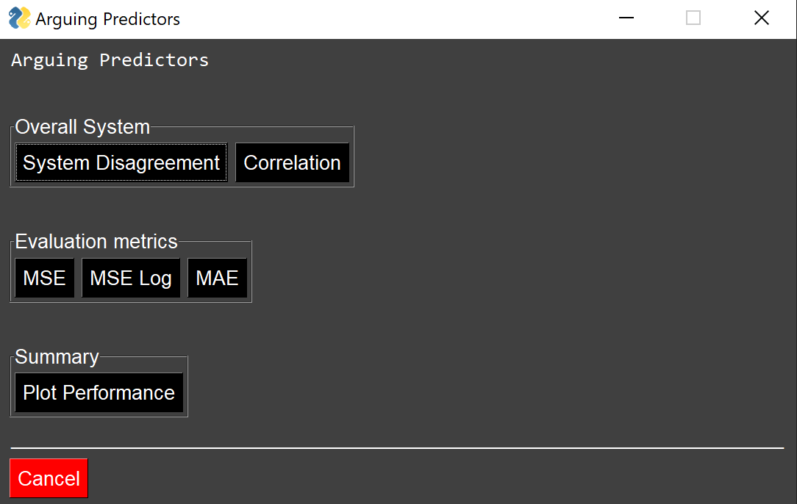

# Arguing Predictors

The aim of this proof-of-concept program is to let multiple individual predictors, forecasting chaotic time series data, communicate with each other and output a consensus prediction. This project will use financial data to test the system performance.

The program is build to be easily extended. New consensus algorithms or individual predictors can be added. 

For more detailed information visit the mkdocs build documentation of this program [here](). This documentation was build with the mkdocs python library which can be found [here](https://www.mkdocs.org/). In case of the mkdocs documentation not yet being published, a preview is possible by doing the follwoing:

First, pip install the mkdocs python library via pip:

```shell
pip install mkdocs
```

Second, cd into the docs directory and execute:

```shell
mkdocs serve
```

Third, after few seconds mkdocs should provide a local address which can be opened in a browser. This address contains the preview of the documentation.

## System structure

```shell
+---arguing_predictors
    +---c 
    |   +---correcting_algorithm.c
    |   +---disagreement_algorithm.c
    +---consensus
    |   +---algorithms.py
    +---docs
    |   +---...
    +---notebooks
    |   +---System.ipynb
    |   +---TestingEnviornment.ipynb
    +---pretrained
    |	+---BI-LSTM_BP_30
    |	+---BI-LSTM_Ford_5
    |   +---BI-LSTM_SP500_40
    |	+---CNN-LSTM_BP_30
    |	+---CNN-LSTM_Ford_5
    |	+---CNN-LSTM_SP500_40
    |	+---CNN_BP_30
    |	+---CNN_Ford_5
    |	+---CNN_SP500_40
    |	+---LSTM_BP_30
    |	+---LSTM_Ford_5
    |	+---LSTM_SP500_40
    |	+---MLP_BP_30
    |	+---MLP_Ford_5
    |	+---MLP_SP500_40
    +---system
    |   +---activate.py
    +---test
    |   +---test_activate.py
    |   +---test_algorithms.py
    |   +---test_dataloader.py
    |   +---test_predictorsI.py
    |   +---test_predictorsII.py
    |   +---test_predictorsIII.py
    +---tools
    |   +---dataloader.py
    |   +---predictorsI.py
    |   +---predictorsII.py
    |   +---predictorsIII.py 
```

## Installation

First download the program repository.

The proof of concept program uses a Jupyter notebook as UI. The program can also be used without a Jupyter notebook by executing the main.py file. In case of executing the main.py file, a small GUI will appear after the model set-up in the file has been successfully trained. The GUI is a window containing buttons to display different statistics about the systems overall performance. However, it is recommended to use the system with a Jupyter notebook and the main.py file to demo the system.

I recommend to use Anaconda to use Jupyter notebook and manage the necessary python libraries for this program. Anaconda can be downloaded [here](https://www.anaconda.com/products/individual#Downloads).

After Anaconda has been downloaded and successfully installed, open the anaconda terminal/command line and create a virtual enviornment with the following command:

```shell
conda create -n yourenvname python=3.8. 
```

After the enviornment is installed, activate it by typing: 

```shell
conda activate yourenvname
```

Please proceed by installing Jupyter notebook by executing:

```shell
conda install jupyter notebook
```

Now, all dependiencies for the program need to be installed. First, pip install torch v.1.6 from [here](https://pytorch.org/get-started/previous-versions/). I recommend to use the CPU only version.

Finally, cd into the program directory and execute:

```shell
pip install -r requierements.txt
```

This will install all other necessary dependencies. For full reference, the full_env_requirements.txt contains all dependencies installed in the anaconda enviornment that was used to build this prototype system.

## Starting the program

Open up an anaconda terminal/command line and activate your enviorment. Now open a Jupyter notebook by executing: 
```shell
jupyter notebook
```
Finally, locate the downloaded repository and open up the System.ipynb contained in the notebook folder. 

Alternatively, to run the program via the main.py file (make sure to be in the directory where the main.py file is located):
```shell
python main.py
```
Depending on what individual predictor configuration is used, training of the model begins and after each completed model training cycle test and validation metrices are graphically shown. After all models in the configuration have been trained, the follwing GUI will appear:



This GUI enables the user to explore the systems consensus predictions and performances in detail.
