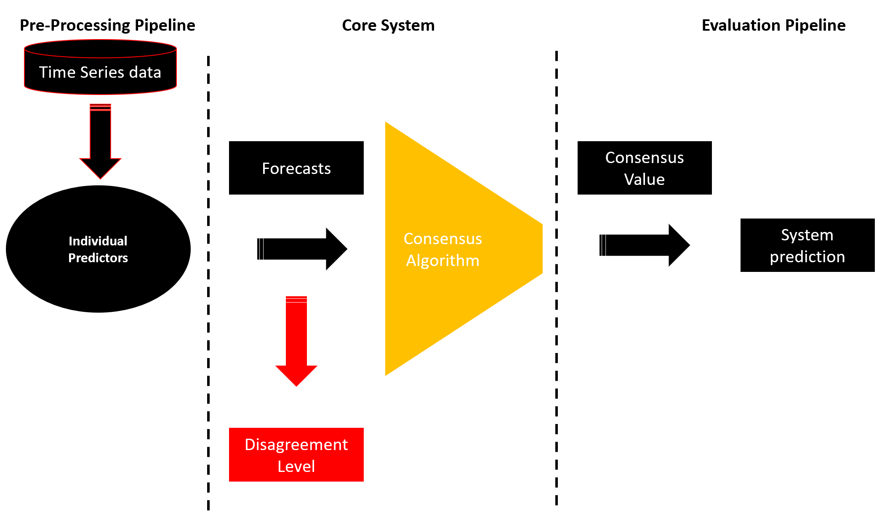

<style>
	.formatting {
		text-align: justify;
	 }
</style>

# Arguing Predictors
<div class="formatting">
The aim of this proof-of-concept program is to let multiple individual predictors, forecasting chaotic time series data, communicate with each other and output a consensus prediction. This project will use financial data to test the system's performance.

The program is build to be easily extended. New consensus algorithms, individual predictors, evaluation methods and data import methods can be added. 

## The System
The proof-of-concept system consists of three main parts: the pre-processing pipeline, the core system and the evaluation pipeline.



## The Directory Structure

```shell
+---arguing_predictors
    +---c 
    |   +---average.c
    |   +---correcting.c
    |   +---disagreement.c
    |   +---main.c
    |   +---prototype.h
    +---consensus
    |   +---algorithms.py
    +---docs
    |   +---docs
    |       +---...
    |   +---mkdocs.yml	
    +---experimental
    |   +---predictorsX.py
    +---notebooks
    |   +---System.ipynb
    |   +---TestingEnviornment.ipynb
    +---pretrained
    |	+---BI-LSTM_BP_30
    |	+---BI-LSTM_Ford_5
    |   +---BI-LSTM_SP500_40
    |	+---CNN-LSTM_BP_30
    |	+---CNN-LSTM_Ford_5
    |	+---CNN-LSTM_SP500_40
    |	+---CNN_BP_30
    |	+---CNN_Ford_5
    |	+---CNN_SP500_40
    |	+---LSTM_BP_30
    |	+---LSTM_Ford_5
    |	+---LSTM_SP500_40
    |	+---MLP_BP_30
    |	+---MLP_Ford_5
    |	+---MLP_SP500_40
    +---system
    |   +---activate.py
    +---test
    |   +---test_activate.py
    |   +---test_evaluation.py
    |   +---test_algorithms.py
    |   +---test_dataloader.py
    |   +---test_predictorsI.py
    |   +---test_predictorsII.py
    |   +---test_predictorsIII.py
    +---tools
    |   +---dataloader.py
    |   +---evaluation.py
    |   +---predictorsI.py
    |   +---predictorsII.py
    |   +---predictorsIII.py 
    +---main.py
```
</div>
