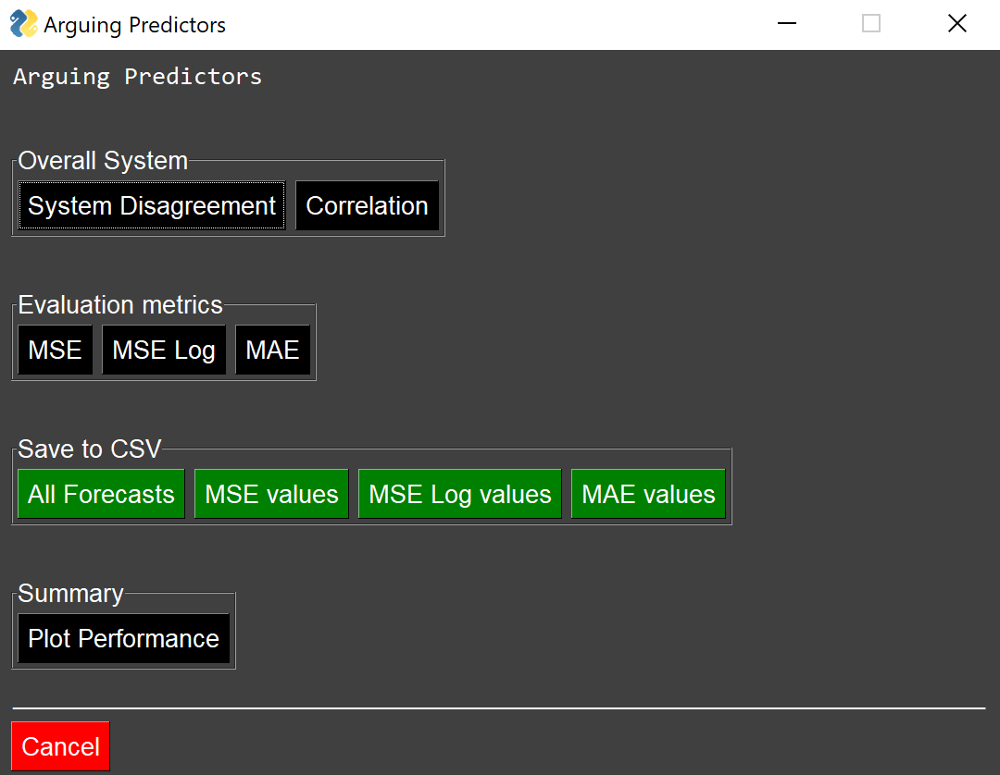

<style>
	.formatting {
		text-align: justify;
	 }
</style>

# System Configuration
<div class="formatting">
The system was designed to be adjusted and modified in multiple ways. First, the "tools" directory contains the individual predictors and supports example predictors based on the Keras python library. This overall framework can be used to add further individual predictor configurations but also offers the liberty to add predictors independent of this format. In the case of diverting from this structure, it is important that the predictor returns a DataFrame containing the future predictions. Lastly, the Keras models already contained within the system can be trained and used as pre-trained models.

Please find in the following examples of the pre-training process in the Pre-trained models section.

The "tools" directory furthermore contains the dataloader which serves to import stock data. Other data can be imported by creating a similar data import solution.

Second, the "consensus" directory contains the algorithms.py file. that build the systems final consensus/prediction value. Further, consensus algorithm solutions can be added here as well. In general, the algorithm will need to take in a DataFrame containing the different predictors forecasts and another list or DataFrame containing actual real values. 

Third, the directory "system" contains the activate.py file which brings all of the individual parts together and enables the system to run. Multiple adjustments can be made here to tailor the systems output.

Fourth, the evaluation.py included within the tools directory provides the system with evaluation capabilities. The standard file contains a correlation analysis of the absolute error of all algorithms, MSE metric, MSE Log metric and MAE metric. Moreover, the evaluation.py file includes plotting functionalities. More evaluation metrics can be added if needed. 

Fifth, the main.py file serves to run the system from a command line. It trains all models specified in the template live and offers a GUI to display the results.

</div>
# activate.py
<div class="formatting">
The following section will break down the activate.py file in detail and suggests how possible modifications might be implemented.

</div>
## Imports
<div class="formatting">
First, all necessary libraries and other parts of the system are imported.

```python
import pandas as pd
from pandas import DataFrame

import sys
sys.path.append('../')

from consensus.algorithms import *
from tools.dataloader import *
from tools.predictorsI import *
from tools.predictorsII import *
from tools.predictorsIII import *
from tools.evaluation import *
```
</div>
## Data preparation
<div class="formatting">
The following function is used to prepare the data into an input batch and real value batch. This function might need adjustments depending on what format other possible predictors may require. In this version, the function is able to deal with all predictors contained in predictorsI.py, predictorsII.py and predictorsIII.py.
```python
def data_prep(df: DataFrame, input_batch_size: int, future_horizon: int) -> [(DataFrame, DataFrame)]:
    '''Takes in data and splits it into an input batch for the individual predictors to perform a prediction on and the real values observed.

        Parameters:
            df (DataFrame): Whole data set to be divided into prediction batch and real values.
            input_batch_size (int): Length of input batch size.
            future_horizon (int): How many time steps are predicted into the future.

        Returns:
            [(DataFrame, DataFrame)]: Input batch dataframe and real value dataframe.
    '''
    input_b = df[0:input_batch_size]
    real_value = df[input_batch_size:input_batch_size + future_horizon]
    
    return input_b, real_value
```
</div>
## Individual predictor live-training templates
<div class="formatting">
The following configurations are examples of how the system can be used with live model training. In detail, these templates train the models in real time instead of loading a pre-trained model. This variation is also used in the demo version of the system in the main.py file. 
```python
def individual_predictors_template0(training_df: DataFrame, input_batch: DataFrame, future_horizon: int, epochs: int) -> DataFrame:
    '''Handles the individual predictors by training them and feeding them the data to predict the specified future horizon. The following individual predictors are implemented:

    1. CNN-LSTM
    2. Bidirectional LSTM
    3. CNN

        Parameters:
            training_df (DataFrame): Data on which the predictors are trained on.
            input_batch (DataFrame): Data which is fed to predictors to predict future values.
            future_horizon (int): Length of how far into the future the predictors will predict.
            epochs (int): Determines for how many epochs each model is trained. 

        Returns:
            (DataFrame): Containing all predictions from all individual predictors.
    '''
    one = HybridUnivariatePredictor(2, len(input_batch), future_horizon, training_df)
    one.create_cnnlstm()
    one.fit_model(epochs)
    one.show_performance()
    
    two = BasicUnivariatePredictor(len(input_batch), future_horizon, training_df)
    two.create_bilstm()
    two.fit_model(epochs)
    two.show_performance()
     
    three = BasicUnivariatePredictor(len(input_batch), future_horizon, training_df)
    three.create_cnn()
    three.fit_model(epochs)
    three.show_performance()
    
    prediction_one = one.predict(input_batch)
    prediction_two = two.predict(input_batch)
    prediction_three = three.predict(input_batch)

    final_df = pd.concat([prediction_one, prediction_two, prediction_three], axis=1) 

    return final_df

def individual_predictors_template1(training_df: DataFrame, input_batch: DataFrame, future_horizon: int, epochs: int) -> DataFrame:
    '''Handles the individual predictors by training them and feeding them the data to predict the specified future horizon. The following individual predictors are implemented:

    1. CNN-LSTM
    2. Bidirectional LSTM
    3. CNN
    4. MLP
    5. LSTM

        Parameters:
            training_df (DataFrame): Data on which the predictors are trained on.
            input_batch (DataFrame): Data which is fed to predictors to predict future values.
            future_horizon (int): Length of how far into the future the predictors will predict.
            epochs (int): Determines for how many epochs each model is trained. 

        Returns:
            (DataFrame): Containing all predictions from all individual predictors.
    '''
    one = HybridUnivariatePredictor(2, len(input_batch), future_horizon, training_df)
    one.create_cnnlstm()
    one.fit_model(epochs)
    one.show_performance()
    
    two = BasicUnivariatePredictor(len(input_batch), future_horizon, training_df)
    two.create_bilstm()
    two.fit_model(epochs)
    two.show_performance()
     
    three = BasicUnivariatePredictor(len(input_batch), future_horizon, training_df)
    three.create_cnn()
    three.fit_model(epochs)
    three.show_performance()
    
    four = BasicUnivariatePredictor(len(input_batch), future_horizon, training_df)
    four.create_mlp()
    four.fit_model(epochs)
    four.show_performance()

    five = BasicUnivariatePredictor(len(input_batch), future_horizon, training_df)
    five.create_lstm()
    five.fit_model(epochs)
    five.show_performance()

    prediction_one = one.predict(input_batch)
    prediction_two = two.predict(input_batch)
    prediction_three = three.predict(input_batch)
    prediction_four = four.predict(input_batch)
    prediction_five = five.predict(input_batch)

    final_df = pd.concat([prediction_one, prediction_two, prediction_three, prediction_four, prediction_five], axis=1) 

    return final_df
```
The following template is a special version of the prior two. This template enables the use of the Facebook prophet and Facebook neural prophet python libraries. These models do not require a specific batch input to forecast.
```python
def individual_predictors_template2(training_df: DataFrame, future_horizon: int) -> DataFrame:
    '''Handles the individual predictors by training them and feeding them the data to predict the specified future horizon. The following individual predictors are implemented:

    1. Facebook Prophet
    2. Facebook Neural Prophet

        Parameters:
            training_df (DataFrame): Data on which the predictors are trained on.
            future_horizon (int): Length of how far into the future the predictors will predict.

        Returns:
            (DataFrame): Containing all predictions from all individual predictors.
    '''    
    one = UnivariatePredictorII(training_df, future_horizon)
    one.fit_neural_model(150, 'D')
    one.show_performance_neural()

    two = UnivariatePredictorII(training_df, future_horizon)
    two.fit_prophet_model()
    two.show_performance_prophet()

    prediction_one = one.predict_neural()
    prediction_two = two.predict_prophet()

    final_df = pd.concat([prediction_one, prediction_two], axis=1) 

    return final_df
```
Please find in the following an example run of this predictor template:

</div>
<embed src="/resources/Facebook.pdf" type="application/pdf" width="100%" height="620px">

## Individual predictor pre-trained templates
<div class="formatting">
The next templates are configured so that a pre-trained Keras model can be used to forecast. These examples use the pre-trained models saved in the "pretrained" directory. It is important to manually set the model id via the set_model_id() setter function.
```python
def individual_predictors_pretrained_Ford_5_2(input_batch: DataFrame, future_horizon: int) -> DataFrame:
    '''Loads pretrained Ford stock model (horizon=5) and predicts based on the given input batch. The following individual predictors are implemented:
    1. LSTM
    2. CNN
        Parameters:
            input_batch (DataFrame): Data which is fed to predictors to predict future values.
            future_horizon (int): Length of how far into the future the predictors will predict.
        Returns:
            (DataFrame): Containing all predictions from all individual predictors.
    '''    
    one = BasicUnivariatePredictor(len(input_batch), future_horizon)
    one.set_model_id('LSTM') # manual model ID/name setting, necessary since model is pretrained and loaded from a file
    one.load_model('../pretrained/LSTM_Ford_5')
 
    two = BasicUnivariatePredictor(len(input_batch), future_horizon)
    two.set_model_id('CNN')
    two.load_model('../pretrained/CNN_Ford_5')

    prediction_one = one.predict(input_batch)
    prediction_two = two.predict(input_batch)

    final_df = pd.concat([prediction_one, prediction_two], axis=1) 

    return final_df

def individual_predictors_pretrained_BP_30_2(input_batch: DataFrame, future_horizon: int) -> DataFrame:
    '''Loads pretrained BP stock model (horizon=30) and predicts based on the given input batch. The following individual predictors are implemented:
    1. LSTM
    2. CNN
        Parameters:
            input_batch (DataFrame): Data which is fed to predictors to predict future values.
            future_horizon (int): Length of how far into the future the predictors will predict.
        Returns:
            (DataFrame): Containing all predictions from all individual predictors.
    '''    
    one = BasicUnivariatePredictor(len(input_batch), future_horizon)
    one.set_model_id('LSTM')
    one.load_model('../pretrained/LSTM_BP_30')
 
    two = BasicUnivariatePredictor(len(input_batch), future_horizon)
    two.set_model_id('CNN')
    two.load_model('../pretrained/CNN_BP_30')

    prediction_one = one.predict(input_batch)
    prediction_two = two.predict(input_batch)

    final_df = pd.concat([prediction_one, prediction_two], axis=1) 

    return final_df

def individual_predictors_pretrained_SP500_40_2(input_batch: DataFrame, future_horizon: int) -> DataFrame:
    '''Loads pretrained SP500 index model (horizon=40) and predicts based on the given input batch. The following individual predictors are implemented:
    1. LSTM
    2. CNN
        Parameters:
            input_batch (DataFrame): Data which is fed to predictors to predict future values.
            future_horizon (int): Length of how far into the future the predictors will predict.
        Returns:
            (DataFrame): Containing all predictions from all individual predictors.
    '''    
    one = BasicUnivariatePredictor(len(input_batch), future_horizon)
    one.set_model_id('LSTM')
    one.load_model('../pretrained/LSTM_SP500_40')
 
    two = BasicUnivariatePredictor(len(input_batch), future_horizon)
    two.set_model_id('CNN')
    two.load_model('../pretrained/CNN_SP500_40')

    prediction_one = one.predict(input_batch)
    prediction_two = two.predict(input_batch)

    final_df = pd.concat([prediction_one, prediction_two], axis=1) 

    return final_df

def individual_predictors_pretrained_Ford_5_3(input_batch: DataFrame, future_horizon: int) -> DataFrame:
    '''Loads pretrained Ford stock model (horizon=5) and predicts based on the given input batch. The following individual predictors are implemented:
    1. LSTM
    2. CNN
    3. MLP
        Parameters:
            input_batch (DataFrame): Data which is fed to predictors to predict future values.
            future_horizon (int): Length of how far into the future the predictors will predict.
        Returns:
            (DataFrame): Containing all predictions from all individual predictors.
    '''    
    one = BasicUnivariatePredictor(len(input_batch), future_horizon)
    one.set_model_id('LSTM')
    one.load_model('../pretrained/LSTM_Ford_5')
 
    two = BasicUnivariatePredictor(len(input_batch), future_horizon)
    two.set_model_id('CNN')
    two.load_model('../pretrained/CNN_Ford_5')

    three = BasicUnivariatePredictor(len(input_batch), future_horizon)
    three.set_model_id('MLP')
    three.load_model('../pretrained/MLP_Ford_5')

    prediction_one = one.predict(input_batch)
    prediction_two = two.predict(input_batch)
    prediction_three = three.predict(input_batch)

    final_df = pd.concat([prediction_one, prediction_two, prediction_three], axis=1) 

    return final_df

def individual_predictors_pretrained_BP_30_3(input_batch: DataFrame, future_horizon: int) -> DataFrame:
    '''Loads pretrained BP stock model (horizon=30) and predicts based on the given input batch. The following individual predictors are implemented:
    1. LSTM
    2. CNN
    3. MLP
        Parameters:
            input_batch (DataFrame): Data which is fed to predictors to predict future values.
            future_horizon (int): Length of how far into the future the predictors will predict.
        Returns:
            (DataFrame): Containing all predictions from all individual predictors.
    '''    
    one = BasicUnivariatePredictor(len(input_batch), future_horizon)
    one.set_model_id('LSTM')
    one.load_model('../pretrained/LSTM_BP_30')
 
    two = BasicUnivariatePredictor(len(input_batch), future_horizon)
    two.set_model_id('CNN')
    two.load_model('../pretrained/CNN_BP_30')

    three = BasicUnivariatePredictor(len(input_batch), future_horizon)
    three.set_model_id('MLP')
    three.load_model('../pretrained/MLP_BP_30')

    prediction_one = one.predict(input_batch)
    prediction_two = two.predict(input_batch)
    prediction_three = three.predict(input_batch)

    final_df = pd.concat([prediction_one, prediction_two, prediction_three], axis=1) 

    return final_df

def individual_predictors_pretrained_SP500_40_3(input_batch: DataFrame, future_horizon: int) -> DataFrame:
    '''Loads pretrained SP500 index model (horizon=40) and predicts based on the given input batch. The following individual predictors are implemented:
    1. LSTM
    2. CNN
    3. MLP
        Parameters:
            input_batch (DataFrame): Data which is fed to predictors to predict future values.
            future_horizon (int): Length of how far into the future the predictors will predict.
        Returns:
            (DataFrame): Containing all predictions from all individual predictors.
    '''    
    one = BasicUnivariatePredictor(len(input_batch), future_horizon)
    one.set_model_id('LSTM')
    one.load_model('../pretrained/LSTM_SP500_40')
 
    two = BasicUnivariatePredictor(len(input_batch), future_horizon)
    two.set_model_id('CNN')
    two.load_model('../pretrained/CNN_SP500_40')

    three = BasicUnivariatePredictor(len(input_batch), future_horizon)
    three.set_model_id('MLP')
    three.load_model('../pretrained/MLP_SP500_40')

    prediction_one = one.predict(input_batch)
    prediction_two = two.predict(input_batch)
    prediction_three = three.predict(input_batch)

    final_df = pd.concat([prediction_one, prediction_two, prediction_three], axis=1) 

    return final_df

def individual_predictors_pretrained_Ford_5_4(input_batch: DataFrame, future_horizon: int) -> DataFrame:
    '''Loads pretrained Ford stock model (horizon=5) and predicts based on the given input batch. The following individual predictors are implemented:
    1. LSTM
    2. CNN
    3. MLP
    4. Bidirectional-LSTM
        Parameters:
            input_batch (DataFrame): Data which is fed to predictors to predict future values.
            future_horizon (int): Length of how far into the future the predictors will predict.
        Returns:
            (DataFrame): Containing all predictions from all individual predictors.
    '''    
    one = BasicUnivariatePredictor(len(input_batch), future_horizon)
    one.set_model_id('LSTM')
    one.load_model('../pretrained/LSTM_Ford_5')
 
    two = BasicUnivariatePredictor(len(input_batch), future_horizon)
    two.set_model_id('CNN')
    two.load_model('../pretrained/CNN_Ford_5')

    three = BasicUnivariatePredictor(len(input_batch), future_horizon)
    three.set_model_id('MLP')
    three.load_model('../pretrained/MLP_Ford_5')

    four = BasicUnivariatePredictor(len(input_batch), future_horizon)
    four.set_model_id('BI-LSTM')
    four.load_model('../pretrained/BI-LSTM_Ford_5')

    prediction_one = one.predict(input_batch)
    prediction_two = two.predict(input_batch)
    prediction_three = three.predict(input_batch)
    prediction_four = four.predict(input_batch)

    final_df = pd.concat([prediction_one, prediction_two, prediction_three, prediction_four], axis=1) 

    return final_df

def individual_predictors_pretrained_BP_30_4(input_batch: DataFrame, future_horizon: int) -> DataFrame:
    '''Loads pretrained BP stock model (horizon=30) and predicts based on the given input batch. The following individual predictors are implemented:
    1. LSTM
    2. CNN
    3. MLP
    4. Bidirectional-LSTM
        Parameters:
            input_batch (DataFrame): Data which is fed to predictors to predict future values.
            future_horizon (int): Length of how far into the future the predictors will predict.
        Returns:
            (DataFrame): Containing all predictions from all individual predictors.
    '''    
    one = BasicUnivariatePredictor(len(input_batch), future_horizon)
    one.set_model_id('LSTM')
    one.load_model('../pretrained/LSTM_BP_30')
 
    two = BasicUnivariatePredictor(len(input_batch), future_horizon)
    two.set_model_id('CNN')
    two.load_model('../pretrained/CNN_BP_30')

    three = BasicUnivariatePredictor(len(input_batch), future_horizon)
    three.set_model_id('MLP')
    three.load_model('../pretrained/MLP_BP_30')

    four = BasicUnivariatePredictor(len(input_batch), future_horizon)
    four.set_model_id('BI-LSTM')
    four.load_model('../pretrained/BI-LSTM_BP_30')

    prediction_one = one.predict(input_batch)
    prediction_two = two.predict(input_batch)
    prediction_three = three.predict(input_batch)
    prediction_four = four.predict(input_batch)

    final_df = pd.concat([prediction_one, prediction_two, prediction_three, prediction_four], axis=1) 

    return final_df

def individual_predictors_pretrained_SP500_40_4(input_batch: DataFrame, future_horizon: int) -> DataFrame:
    '''Loads pretrained SP500 index model (horizon=40) and predicts based on the given input batch. The following individual predictors are implemented:
    1. LSTM
    2. CNN
    3. MLP
    4. Bidirectional-LSTM
        Parameters:
            input_batch (DataFrame): Data which is fed to predictors to predict future values.
            future_horizon (int): Length of how far into the future the predictors will predict.
        Returns:
            (DataFrame): Containing all predictions from all individual predictors.
    '''    
    one = BasicUnivariatePredictor(len(input_batch), future_horizon)
    one.set_model_id('LSTM')
    one.load_model('../pretrained/LSTM_SP500_40')
 
    two = BasicUnivariatePredictor(len(input_batch), future_horizon)
    two.set_model_id('CNN')
    two.load_model('../pretrained/CNN_SP500_40')

    three = BasicUnivariatePredictor(len(input_batch), future_horizon)
    three.set_model_id('MLP')
    three.load_model('../pretrained/MLP_SP500_40')

    four = BasicUnivariatePredictor(len(input_batch), future_horizon)
    four.set_model_id('BI-LSTM')
    four.load_model('../pretrained/BI-LSTM_SP500_40')

    prediction_one = one.predict(input_batch)
    prediction_two = two.predict(input_batch)
    prediction_three = three.predict(input_batch)
    prediction_four = four.predict(input_batch)

    final_df = pd.concat([prediction_one, prediction_two, prediction_three, prediction_four], axis=1) 

    return final_df

def individual_predictors_pretrained_Ford_5_5(input_batch: DataFrame, future_horizon: int) -> DataFrame:
    '''Loads pretrained Ford stock model (horizon=5) and predicts based on the given input batch. The following individual predictors are implemented:
    1. LSTM
    2. CNN
    3. MLP
    4. Bidirectional-LSTM
    5. CNN-LSTM
        Parameters:
            input_batch (DataFrame): Data which is fed to predictors to predict future values.
            future_horizon (int): Length of how far into the future the predictors will predict.
        Returns:
            (DataFrame): Containing all predictions from all individual predictors.
    '''    
    one = BasicUnivariatePredictor(len(input_batch), future_horizon)
    one.set_model_id('LSTM')
    one.load_model('../pretrained/LSTM_Ford_5')
 
    two = BasicUnivariatePredictor(len(input_batch), future_horizon)
    two.set_model_id('CNN')
    two.load_model('../pretrained/CNN_Ford_5')

    three = BasicUnivariatePredictor(len(input_batch), future_horizon)
    three.set_model_id('MLP')
    three.load_model('../pretrained/MLP_Ford_5')

    four = BasicUnivariatePredictor(len(input_batch), future_horizon)
    four.set_model_id('BI-LSTM')
    four.load_model('../pretrained/BI-LSTM_Ford_5')

    five = HybridUnivariatePredictor(sub_seq = 2, steps_past = len(input_batch), steps_future = future_horizon)
    five.set_model_id('CNN-LSTM')
    five.load_model('../pretrained/CNN-LSTM_Ford_5')

    prediction_one = one.predict(input_batch)
    prediction_two = two.predict(input_batch)
    prediction_three = three.predict(input_batch)
    prediction_four = four.predict(input_batch)
    prediction_five = five.predict(input_batch)

    final_df = pd.concat([prediction_one, prediction_two, prediction_three, prediction_four, prediction_five], axis=1) 

    return final_df

def individual_predictors_pretrained_BP_30_5(input_batch: DataFrame, future_horizon: int) -> DataFrame:
    '''Loads pretrained BP stock model (horizon=30) and predicts based on the given input batch. The following individual predictors are implemented:
    1. LSTM
    2. CNN
    3. MLP
    4. Bidirectional-LSTM
    5. CNN-LSTM
        Parameters:
            input_batch (DataFrame): Data which is fed to predictors to predict future values.
            future_horizon (int): Length of how far into the future the predictors will predict.
        Returns:
            (DataFrame): Containing all predictions from all individual predictors.
    '''    
    one = BasicUnivariatePredictor(len(input_batch), future_horizon)
    one.set_model_id('LSTM')
    one.load_model('../pretrained/LSTM_BP_30')
 
    two = BasicUnivariatePredictor(len(input_batch), future_horizon)
    two.set_model_id('CNN')
    two.load_model('../pretrained/CNN_BP_30')

    three = BasicUnivariatePredictor(len(input_batch), future_horizon)
    three.set_model_id('MLP')
    three.load_model('../pretrained/MLP_BP_30')

    four = BasicUnivariatePredictor(len(input_batch), future_horizon)
    four.set_model_id('BI-LSTM')
    four.load_model('../pretrained/BI-LSTM_BP_30')

    five = HybridUnivariatePredictor(sub_seq = 2, steps_past = len(input_batch), steps_future = future_horizon)
    five.set_model_id('CNN-LSTM')
    five.load_model('../pretrained/CNN-LSTM_BP_30')

    prediction_one = one.predict(input_batch)
    prediction_two = two.predict(input_batch)
    prediction_three = three.predict(input_batch)
    prediction_four = four.predict(input_batch)
    prediction_five = five.predict(input_batch)

    final_df = pd.concat([prediction_one, prediction_two, prediction_three, prediction_four, prediction_five], axis=1) 

    return final_df

def individual_predictors_pretrained_SP500_40_5(input_batch: DataFrame, future_horizon: int) -> DataFrame:
    '''Loads pretrained SP500 index model (horizon=40) and predicts based on the given input batch. The following individual predictors are implemented:
    1. LSTM
    2. CNN
    3. MLP
    4. Bidirectional-LSTM
    5. CNN-LSTM
        Parameters:
            input_batch (DataFrame): Data which is fed to predictors to predict future values.
            future_horizon (int): Length of how far into the future the predictors will predict.
        Returns:
            (DataFrame): Containing all predictions from all individual predictors.
    '''    
    one = BasicUnivariatePredictor(len(input_batch), future_horizon)
    one.set_model_id('LSTM')
    one.load_model('../pretrained/LSTM_SP500_40')
 
    two = BasicUnivariatePredictor(len(input_batch), future_horizon)
    two.set_model_id('CNN')
    two.load_model('../pretrained/CNN_SP500_40')

    three = BasicUnivariatePredictor(len(input_batch), future_horizon)
    three.set_model_id('MLP')
    three.load_model('../pretrained/MLP_SP500_40')

    four = BasicUnivariatePredictor(len(input_batch), future_horizon)
    four.set_model_id('BI-LSTM')
    four.load_model('../pretrained/BI-LSTM_SP500_40')

    five = HybridUnivariatePredictor(sub_seq = 2, steps_past = len(input_batch), steps_future = future_horizon)
    five.set_model_id('CNN-LSTM')
    five.load_model('../pretrained/CNN-LSTM_SP500_40')

    prediction_one = one.predict(input_batch)
    prediction_two = two.predict(input_batch)
    prediction_three = three.predict(input_batch)
    prediction_four = four.predict(input_batch)
    prediction_five = five.predict(input_batch)

    final_df = pd.concat([prediction_one, prediction_two, prediction_three, prediction_four, prediction_five], axis=1) 

    return final_df
```
</div>
## System disagreement
<div class="formatting">
This function wraps around the system disagreement functions contained in the algorithms.py and plots the results.
```python
def system_disagreement(df: DataFrame):
    '''Plots the overall system disagreement and the individual disagreement scores of the algorithms.
       
        Parameters:
            df (DataFrame): Containing all individual predictors forecasts.
    '''
    disagreement(df).plot()
    predictor_score(df).plot()
```
</div>
## System consensus value
<div class="formatting">
This function wraps around the consensus value creation functions contained in the algorithms.py.
```python
def consensus(df: DataFrame, real: DataFrame) -> DataFrame:
    '''Applies the following consensus algorithm to provide the final system forecast:

    1. Average
    2. No Memory
    3. Memory
    4. Focus
    5. Anchor
    6. Correcting
    7. Correcting Memory

        Parameters:
            df (DataFrame): Forecasts of all individual predictors.
            real (DataFrame): The true/actual values.

        Returns:
            (DataFrame): Containing all final consensus values from all algorithms.
    '''
    consensus = pd.DataFrame() # DataFrame that will hold all consensus values
    
    average = average_consolidation(df)
    nomemory = consolidated_predictions(df, real)
    memory = consolidated_predictions_memory(df, real)
    focus = consolidated_predictions_focused(df, real)
    anchor = consolidated_predictions_anchor(df, real, 3.5)
    correcting = consolidated_predictions_correcting(df, real)
    correcting_mem = consolidated_predictions_memory_correcting(df, real)
    
    consensus['Average'] = average
    consensus['NoMemory'] = nomemory
    consensus['Memory'] = memory
    consensus['Focus'] = focus
    consensus['Anchor'] = anchor
    consensus['Correcting'] = correcting
    consensus['Correcting Memory'] = correcting_mem
    
    return consensus
```
</div>
## Correcting consensus algorithm only
<div class="formatting">
This is an alternative version of the prior consensus function that allows to only apply the correcting consensus value algorithm.
```python
def consensus_optimal(df: DataFrame, real: DataFrame) -> DataFrame:
    '''Applies the correcting consensus algorithm to provide the final system forecast.

        Parameters:
            df (DataFrame): Forecasts of all individual predictors.
            real (DataFrame): The true/actual values.

        Returns:
            (DataFrame): Containing all final consensus values from all algorithms.
    '''
    consensus = pd.DataFrame() # DataFrame that will hold consensus values

    correcting = consolidated_predictions_correcting(df, real)    
    consensus['Correcting'] = correcting
 
    return consensus
```
</div>
# main.py
<div class="formatting">
This file contains the logic of running the system from a command line. Multiple adjustments can be made to further tailor the system.
</div>
## Importing the system
<div class="formatting">
This part of the code imports the python library PySimpleGUI to generate the GUI after the models have completed the training cycle. Moreover, it imports the proof-of-concept system.
```python
import PySimpleGUI as sg
import pandas as pd

from tools.dataloader import *
from system.activate import *
```
</div>
## System activation - Live training
<div class="formatting">
The next part initiates the live training process of the models defined and applies all other functions to generate the consensus value and evaluation metrics. This code should be modified to change the stock, trainings data, prediction horizon data, evaluation function, individual prediction models and consensus algorithms used. It is recommended to set-up other prediction and consensus algorithms and any other new functions within the activate.py file.
```python
def main():
    '''Example main function to execute the system without a jupyter notebook as UI.
    '''
    predict = DataLoader('BP', '2018-02-01', '2018-05-01') # loading DataFrame of time-frame to be predicted
    predict = predict.get_adjclose()

    training = DataLoader('BP', '2015-01-01', '2018-01-01') # loading training DataFrame to train model on
    training = training.get_adjclose()

    predict_req, real = data_prep(predict, 20, 30) # dividing data into predictor input and real data
    individual_predictors_forecasts = individual_predictors_template1(training, predict_req, 30, 5) # make forecast
    consensus_forecasts = consensus(individual_predictors_forecasts, real) # create consolidation values
    #consensus_forecasts = consensus_optimal(individual_predictors_forecasts, real) # create consolidation value only with correcting algorithm
    all_forecasts = combined_frame(individual_predictors_forecasts, consensus_forecasts, real) 
    prediction_error = absolute_error_analytics(individual_predictors_forecasts, consensus_forecasts, real) # create absolute error DataFrame
```
The next part defines the GUI pop-up window layout:
```python
    # build GUI for data visualization
    sg.ChangeLookAndFeel('Dark')      
    sg.SetOptions(element_padding=(5, 5))

    layout = [

              [sg.Text('Arguing Predictors', font=('Consolas', 10))],

              [sg.Text(''  * 50)],      

              [sg.Frame('Overall System',[[ 
              sg.Button('System Disagreement', button_color=('black')),
              sg.Button('Correlation', button_color=('black'))]])], 

              [sg.Text(''  * 70)],      

              [sg.Frame('Evaluation metrics',[[ 
              sg.Button('MSE', button_color=('black')), 
              sg.Button('MSE Log', button_color=('black')), 
              sg.Button('MAE', button_color=('black'))]])],

              [sg.Text(''  * 70)],      

              [sg.Frame('Save to CSV',[[ 
              sg.Button('All Forecasts', button_color=('green')),
              sg.Button('MSE values', button_color=('green')),
              sg.Button('MSE Log values', button_color=('green')),
              sg.Button('MAE values', button_color=('green'))]])], 

              [sg.Text(''  * 70)],      

              [sg.Frame('Summary',[[ 
              sg.Button('Plot Performance', button_color=('black'))]])],

              [sg.Text('_'  * 70)],      

              [sg.Cancel(button_color=('red'))]]

    window = sg.Window('Arguing Predictors', layout, default_element_size=(40, 1))
```

The code in the above generates with help of the PySimpleGUI library the following simple GUI window:


</div>




Finally, the while loop in the below adds functionality to the buttons created in the prior part:
```python
    while True:
        event, values = window.read()
        if event in (sg.WIN_CLOSED, 'Cancel'):
            break
        elif event == 'System Disagreement':            
            system_disagreement(individual_predictors_forecasts)
            plt.tight_layout()
            plt.show(block=False)
        elif event == 'Correlation':
            correlation(prediction_error, True)
            plt.tight_layout()
            plt.show(block=False)
        elif event == 'MSE':
            mse_score(all_forecasts, True)
            plt.show(block=False)
        elif event == 'MSE Log':
            mse_log_score(all_forecasts, True)
            plt.show(block=False)
        elif event == 'MAE':
            mae_score(all_forecasts, True)
            plt.show(block=False)
        elif event == 'All Forecasts':
            all_forecasts.to_csv('All_Forecasts.csv') # the following four buttons save the target data in csv format into the same directory where the main.py file has been executed
        elif event == 'MSE values':
            mse_score(all_forecasts).to_csv('MSE.csv')
        elif event == 'MSE Log values':
            mse_log_score(all_forecasts).to_csv('MSE_Log.csv')
        elif event == 'MAE values':
            mae_score(all_forecasts).to_csv('MAE.csv')
        elif event == 'Plot Performance':
            plot_performance(all_forecasts)
            plt.show(block=False)

    window.close()

if __name__ == "__main__":
    main()
```
